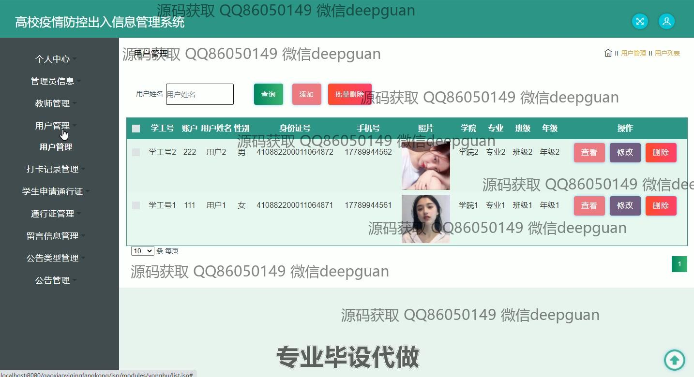

<h1 align="center">基于SSM的高校疫情防控出入信息管理系统+jsp</h1>

## 简介
高校疫情防控出入信息管理系统：角色分为管理员、用户、教师；功能涵盖用户管理、教师管理、通行证管理、打卡记录管理、公告管理、留言信息管理，优化高校疫情防控工作流程。    --计算机毕业设计源码；毕设源码；java毕业设计源码

## 联系方式

<h3 align="center">获取完整代码与数据库文件 + 微信：deepguan QQ: 86050149 QQ群: 783742310</h3>

<h3 align="center">可帮忙远程部署 包运行成功！提供远程部署、修改代码、设计文档指导、代码讲解等服务！</h3>

## 功能介绍（完整见运行截图）
管理员：管理员可以通过系统进行教师、用户和通行证的管理。其功能包括查看和编辑教师与用户的个人信息，管理和审核通行证申请，发布和管理公告，管理用户的留言信息。管理员还可以修改系统中的设置，确保信息录入准确并按需进行批量删除。  

教师：教师在系统中可以注册和登录，修改个人信息，以及管理与随时查看本人的出入记录。教师还具备申请和管理通行证的权限，掌握个人或学生的通行状态与打卡记录。

学生：学生可以登录系统申请通行证，并根据需要查看或修改个人信息，如学号、姓名和联系方式等。学生在系统中能实现对本人的打卡记录查询，并查看通行证的状态以便合规进出校园。

用户：用户即为普通学生或教师，可以通过系统查看和更新个人信息，查询本人的通行记录与打卡信息。根据不同的权限，用户可以申请通行证，并对系统中的公告内容提出留言或者进行互动。

## 运行截图

本代码来源于网络,仅供学习参考使用!

